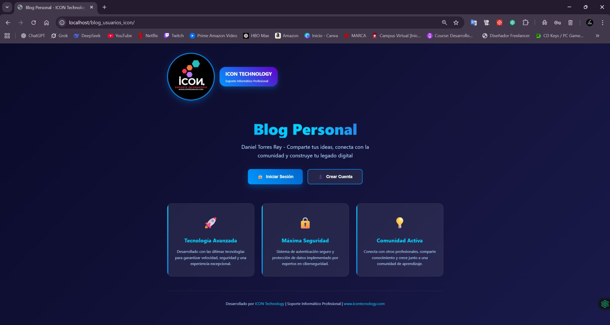
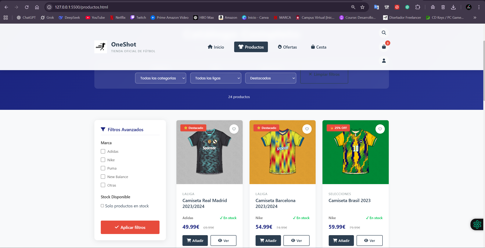

<!-- Banner -->

<h1 align="center">Daniel Torres Rey | @ICON TECNOLOGY ✨</h1>

  
  
  

 
<h2 align="left">Sobre mí 😃</h2>

🎓 ESTUDIANTE DE DESARROLLO DE APLICACIONES MULTIPLATAFORMA (DAM) 
Apasionado por la tecnología y la resolución de problemas a través del código. Actualmente, en mi primer año de estudios, adquiriendo experiencia en programación con Dart y Visual Studio.

🎓 TÉCNICO EN SISTEMAS MICROINFORMÁTICOS Y REDES (SMR)
Especializado en la reparación y mantenimiento de hardware y software, con experiencia en instalación de sistemas operativos, formateo de equipos y eliminación de virus.💻

🛠 CEO DE ICON TECNOLOGY
Emprendedor, desarrollador web y técnico informático con experiencia en soporte de hardware y software, diseño web y redes. Más de un año ofreciendo soluciones tecnológicas a empresas y negocios.

### Skills

<h2 align="left">📂Proyectos Personales:</h2>
<table align="center">
  <tr>
    <td align="center">
      
      
<b>Pagina Web Icon Tecnology</b>

      
HTML • CSS • JAVA

    </td>
    <td align="center">
      
      
<b>Pagina Web Pintura Decorativa e Industrial</b>

      
HTML • CSS • JAVA

    </td>
    <td align="center">
      
      
<b>Blog Personal ICONTech</b>

      
HTML • CSS • PHP • MYSql

    </td>
      <td align="center">
      
      
<b>Tienda Online Camisetas</b>

      
HTML • CSS • jSON 

    </td>
  </tr>
</table>
